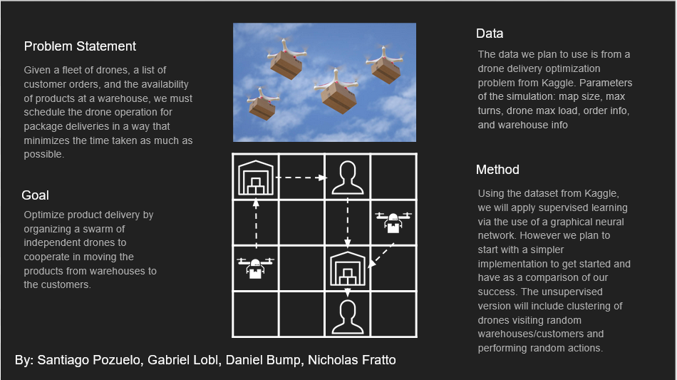

## Table of Contents

* [Summary](#summary)
* [Introduction & Background](#introduction--background)
  * [Q-Learning](#q-learning)
  * [Graphical Neural Network (GNN)](#graphical-neural-network-gnn)
* [Methods](#methods)
* [Results](#results)
* [Discussion](#discussion)
* [References](#references)

## Summary

## Introduction & Background
Drones and drone swarms are an emerging and increasingly researched domain of robotics, computer vision, and, in our case, machine learning. One of the many applications of drones is in delivery of products to customers. Because of the fact drones are unmanned, not subject to traffic, and cost effective, they are a more ideal choice than the current method of delivery, trucks. However, drones are a finite resource and have a small maximum carry load. This means that the process for picking up packages and delivering them to customers in a short amount of time is paramount in the transition from delivery trucks to an all-drone delivery system. Our project aims to try and advance the scheduling algorithm these drones use to ensure that deliveries are completed in the the most time-effective manner through the use of machine learning.

The overall goal of our project can be summarized as follows: given a set number of drones, the location of customers and warehouses, and a list of products available at warehouses and customers who want them, find the set of orders for the drones that completes all deliveries in the shortest amount of time possible.

This problem is an in-progress [Kaggle competition](https://www.kaggle.com/c/hashcode-drone-delivery/overview) at the time of attempting this project.

## Methods

### Q-Learning
We expect to first use Q-Learning to solve the problem through reinforcement learning. In this case, the drones are our agents, and the actions are listed in the [Kaggle instructions](https://www.kaggle.com/c/hashcode-drone-delivery/data?select=hashcode_delivery_instructions.pdf). We intend to reward states that have products closer to customers. This would mean a drone carrying a load to a warehouse closer to a customer would increase the reward, and of course, delivering a product to a customer would increase reward further. There are cases where a drone should not only be completing a delivery in every flight. For example, a drone could pick up a side product, drop it off to another warehouse on the way to its main customer, then return to that closer warehouse later and pick up all the product necessary for this second order. 

### Graphical Neural Network (GNN)
Our stretch goal is to use a Graphical Neural Network (GNN), an uncommon approach. This implementation will be very difficult, which is why we left it as a stretch goal, however, we believe it is an extremely interesting and novel approach to the problem that may produce better results than typical approaches.

## Results

Many people have offered many solutions to this problem and ones of a similar nature. We think it is unlikely that we will be able to surpass the best of these. That being said, we believe that our approach to the problem is unique and may open new possibilities in terms of how people think about similar problems. Additionally, it will provide valuable insight into topics that have gone uncovered in class and increase our teams understanding of machine learning in a broader sense, our ultimate goal.

## Discussion

## References
[1] Scarselli, F., Gori, M., Tsoi, A. C., Hagenbuchner, M., & Monfardini, G. (2008). The graph neural network model. _IEEE Transactions on Neural Networks_, 20(1), 61-80.

